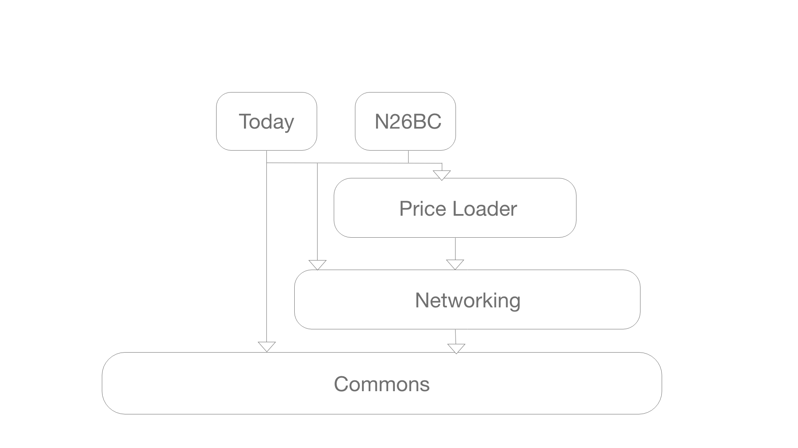

# N26BC
> Fetches current and historical bitcoin - Euro/Dollar/Pound exchange data from BitcoinDesk.com

[![Swift Version][swift-image]][swift-url]

## Features

- [x] List of the last 14 days exchange rate
- [x] Detail of the exchange rate in EUR, USD, and GBP
- [x] Today extension showing the current exchange rate in EUR

## Requirements

- iOS 11.0+

## Structure

## Usage example

## Meta

Aaron Huánuco – aaronmhr@gmail.com

[https://github.com/aaronmhr/N26BC](https://github.com/aaronmhr/N26BC)

[swift-image]:https://img.shields.io/badge/swift-5.0-orange.svg
[swift-url]: https://swift.org/
