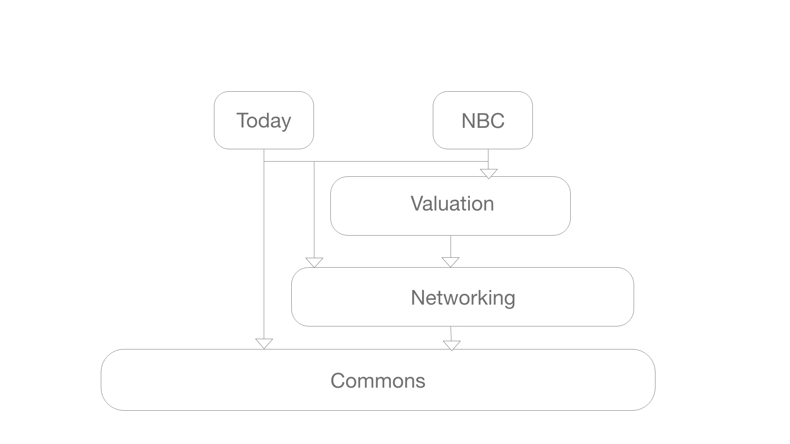

# NBC
> Fetches current and historical bitcoin - Euro/Dollar/Pound exchange data from BitcoinDesk.com

[![Swift Version][swift-image]][swift-url]

This project displays exchange rate for BitCoin in an iOS app with a list/detail view and a Today extension. 
The code is divided in diferent targets

| Module        | Contains           | Is UI  |
| ------------- |:-------------:| -----:|
| Commons     | Common use extensions, mainly related with formatting | UI-Agnostic |
| Networking      | Networking related Code      |   UI-Agnostic |
| Valuation | Features/Use cases      |    UI-Agnostic |
| NBC     | iOS app in VIPER, contains a list view and a detail view | UI-Specific |
| BitCoinPrice      | Today extension      |   UI-Specific |

## Screenshots

  

## Features

- [x] List of the last 14 days BTC to € exchangean rate
- [x] Detail of the exchange rate in EUR, USD, and GBP
- [x] Today extension showing the current BTC exchange rate in EUR

## Requirements

- iOS 11.0+

## Structure

## Usage example

## Meta

Aaron Huánuco – aaronmhr@gmail.com

[https://github.com/aaronmhr/NBC](https://github.com/aaronmhr/NBC)

[swift-image]:https://img.shields.io/badge/swift-5.0-orange.svg
[swift-url]: https://swift.org/
